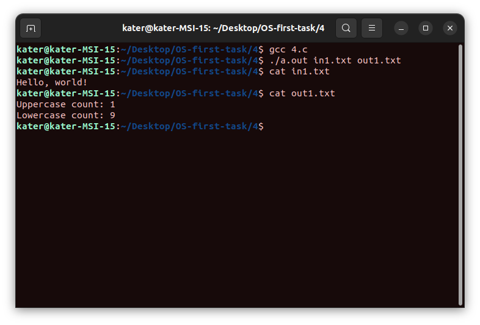
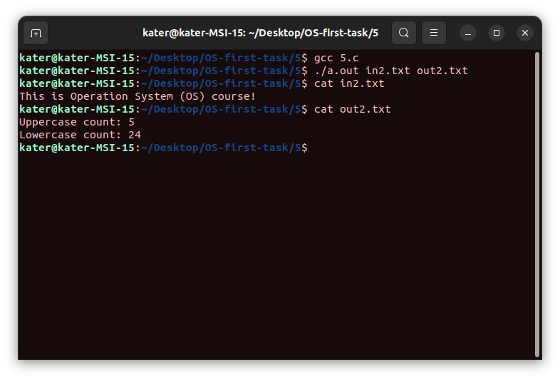
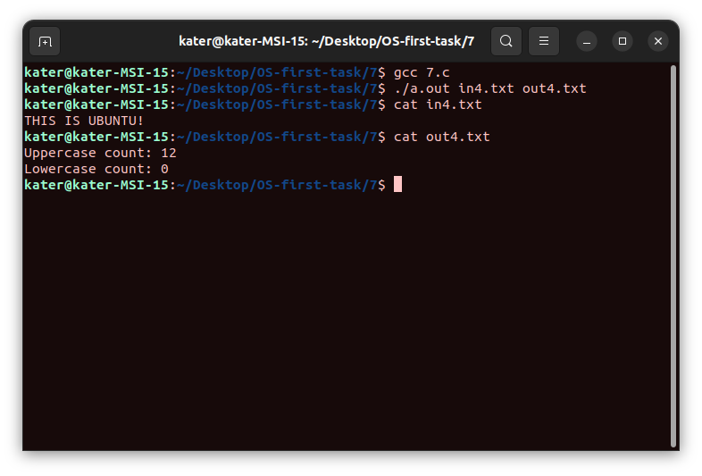

# Операционные системы. ИДЗ №1. Вариант 14.

#### Выполнил Старцев Евгений Борисович, БПИ219.

## Условие

Разработать программу, вычисляющую отдельно число прописных и строчных букв в заданной ASCII-строке.

## Отчёт

Для того чтобы запустить программу, необходимо прописать следующие команды:

```c
gcc file.c
./a.out input.txt output.txt
```

где `file.c` - файл с кодом, `input.txt` - файл с входными данными, `output.txt` - файл с выходными данными.

## Небольшое предисловие

Во время выполнения ИДЗ я понял, что из формулировки требований к заданию не совсем понятно, а сколько же всего
процессов должно быть, должны ли они быть все дочерними, или же обязательно родительский процесс должен принимать
участие в выполнении задания. Поэтому я решил сделать и так, и так - в заданиях на 4 и 5 задача выполняется с
использованием дочерних процессов, а родительский процесс только ждёт их выполнения и завершает программу, а в заданиях
на 6 и 7 родительский процесс непосредственно участвует в выполнении поставленной задачи.

### Решение на 4 балла.

Исходные коды и файлы для тестирования расположены в [папке 4](4). Файл непосредственно с исходным кодом - [4.c](4/4.c).

В данной программе используется три процесса. Первый процесс считывает данные из файла и передает их другому процессу
через неименованный канал, который выполняет поставленную задачу. После этого через второй неименованный канал
происходит передача данных в третий процесс, в котором осуществляется вывод результата в файл. Все три процесса являются
дочерними. Родительский процесс же просто ждёт, когда они завершат работу, после чего завершает работу программы.


### Решение на 5 баллов.

Исходные коды и файлы для тестирования расположены в [папке 5](5). Файл непосредственно с исходным кодом - [5.c](5/5.c).

По факту программы на 5 и на 4 балла отличаются только тем, что в программе на 5 баллов используются именованные каналы
для передачи данных (создаются с помощью команды `mkfifo`).



### Решение на 6 баллов.

Исходные коды и файлы для тестирования расположены в [папке 6](6). Файл непосредственно с исходным кодом - [6.c](6/6.c).

В отличие от программ на 4 и на 5 баллов, в программах на 6 (и на 7 баллов) родительский процесс выполняет часть работы.
Команда `fork` запускается только один раз. В родительском процессе происходит получение
данных из файла, а также запись полученного результата в файл (после того, как отработал дочерний процесс, в котором
осуществляются действия с данными в соответствии с заданием).

### Решение на 7 баллов.

Исходные коды и файлы для тестирования расположены в [папке 7](7). Файл непосредственно с исходным кодом - [7.c](7/7.c).

По факту программы на 6 и на 7 баллов отличаются только тем, что в программе на 7 баллов используются именованные каналы
для передачи данных (создаются с помощью команды `mkfifo`).



## Заключение

Удачи во всём!)


